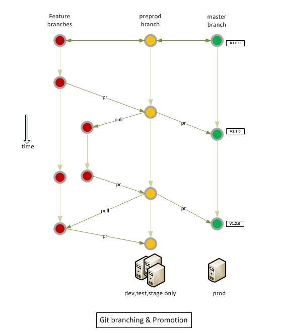

# everything-as-code
Everything as Code is like any other application code that represents infrastructure, security, compliance and operations to ensure agility while maintaining governance.
Terraform  is used as a tool for building, changing, and versioning of infrastructure, security and compliance polices.
Microstrategy Cloud Provisioning API is used for deploying the EC2 Instances and Microstrategy Application.
Finally, we construct the build pipelines for our software using a Jenkins Groovy DSL.

| Branch | Status |
|--------|--------|
|preprod||
|release-v9.1||

### Benefits
* Code managed in this repository is versioned, under change control, tracked, peer reviewed and tested just like application software. Acts as an single source of truth by effectively representing the current infrastructure. Versioning help maintains the history of changes made for easy role back and troubleshooting
* Code managed in this repository go through continues delivery pipeline to ensure that changes are tested and deployed in a controlled manner before moving to production environments. Changes are made to [source code](terraform/src/) flow through lower environments first and fully tested before moving them to higher environments

## Section 1: Product Summary

| Product Name | Ask ID          | Technical Lead | PMO Lead       |
| ------------ | --------------- | -------------- | -------------- |
| Optum Performance Analytics  | UHGWM110-017897 | John Hancock  | JoEllen Komanetsky |

### Description

OPA is a multi tentant Customer facing web application to allow Population Management and System Level Reporting for Provider Group clients.  It is based on the Microstrategy BI Tool.

### Data Usage

All data that is stored within OPA is owned by the Tenant.  

### Workload Criteria

## Section 2: Code Management, Git Branching & Promotion

## Section 3: Architecture

We  are using the more sophisticated diagraming tools available in the Optum Wiki to document our architecture.

If you are unable to see these documents, please request "Confluence" in https://secure.uhc.com/

OPA Architecture: https://new-wiki.optum.com/display/OPA/OPA+architecture+on+AWS

### EIS Security Endorsement :
----------
[EIS Endorsement](documents/EIS-Solution-Intent.md)

#### HITRUST certification

All of the AWS services used are HITRUST certified.

#### Exceptions:

Some of the AWS resources (EC2 instances, ALB, RDS for Metadata) are created by the MicroStrategy Cloud Provisioning Console rather than by Terraform.

#### PaaS vs. IaaS vs. SaaS:

Whenever possible, we use PaaS solutions native within AWS:

* Elastic Load Balancer
* Lambda
* Redshift
* RDS
* S3

The MicroStrategy Cloud console provisions EC2 instances natively, which are
effectively IaaS, but from Optum's perspective this is similar to working
with a SaaS solution.  That is, the vendor is responsible for provisioning
and deploying software to the EC2 instances.

## Section 4: Network Summary
Accounts and Isolation Strategy: https://new-wiki.optum.com/display/OPA/Accounts+and+isolation+strategy
